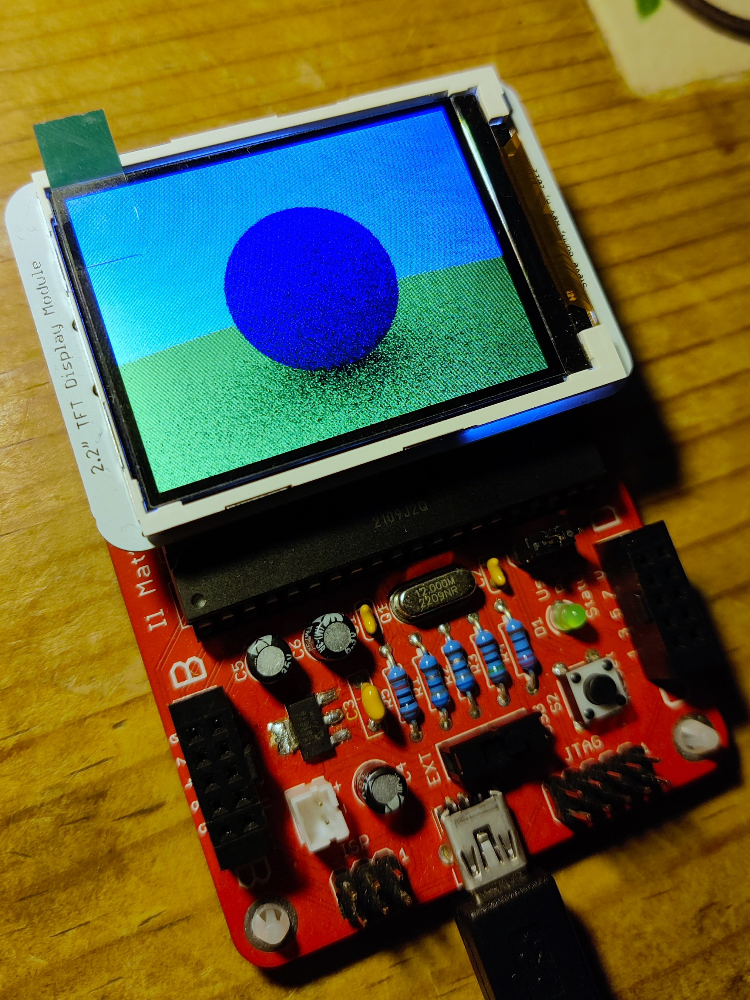
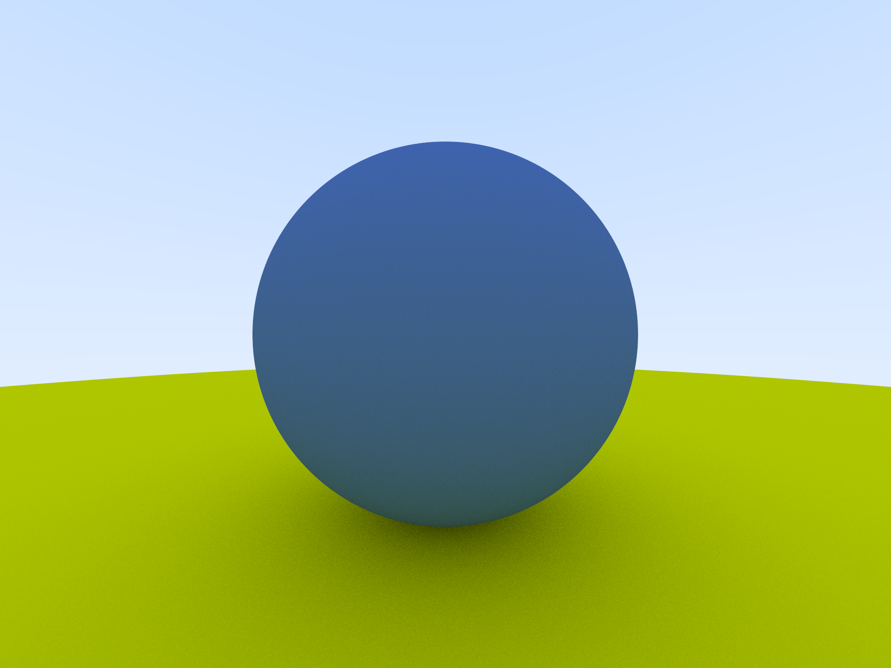

# Il Matto Raytracer

[![CC BY-SA 4.0][cc-by-sa-shield]][cc-by-sa]





This repository contains a basic implimentation of a raytracing engine that can run on the Il Matto board with 2.2” TFT Display Module, created by [Professor Steve Gunn](https://www.southampton.ac.uk/people/5wzhph/professor-steve-gunn) at the University of Southampton. This board is based off the ATmega644P.

The raytracing engine was translated to C from the book [Ray Tracing in One Weekend](https://raytracing.github.io/books/RayTracingInOneWeekend.html) by Peter Shirley.

## Requirements

* avr-gcc
* avrdude
* GNU Make

## Installation

Clone this repository and execute

```
make
```
_(GNU Make is required)_

This will generate the hex file in `build/`.

To upload the file run

```
avrdude -c usbasp -p m644p -U flash:w:build/ilmattoraytracer.hex
```

## Notes

The image that is drawn on the screen is not simply being read from memory and displayed (the Il Matto does not even have enough to store a full raw frame buffer), rather each pixel is being generated one by one.

It takes a signifincantly long time to draw a full frame with this program (approximately 15 minutes) for a few reasons:
1. The ATmega644P is not a powerful chip
2. __The algorithm used is non-deterministic__, and not particularly optimised
3. Each pixel must be sampled at least a few times

The way it works is roughly
1. For the current pixel create a ray and project it out of the camera
2. Check if the ray intersects with any object in the world
3. If it does, scatter the ray based on the material
4. Work out the colour of the ray after its full path has been traced
5. Repeat this a few times
6. When a full line has been calculated, draw it on the screen

It is important to note that when the ray is scattered, the function recursively calls itself for the new ray, which is not a good idea. There is a maximum depth before the stack size is reached somewhere between 10-50 calls, at which point __the ATmega will reset itself__.

The raytracer supports the material types Lambertian, Metal and Dielectric. To customise the objects in the world, edit `src/main.c`.

To define a material:
```c
const material material_ground = {lambertian, .albedo = (colour){0.8, 0.8, 0.0}};
const material material_left = {dielectric, .ir = 1.5};
const material material_right = {metal, .albedo = (colour){0.8, 0.6, 0.2}, .fuzz = 0};
```
To define an object using a material:
```c
hittable_list* h = create_list(3);
h->list[0] = &(sphere){(point){0, -100.5, -1}, 100, &material_ground};
h->list[1] = &(sphere){(point){-1, 0, -1}, 0.5, &material_left};
h->list[2] = &(sphere){(point){0.5, 0, -1}, 0.5, &material_right};
```
__`create_list(int length)` must be supplied the (maximum) number of objects you plan on creating__.

## Todo

* Remove uneccessary code from `lcdlib`
* Impliment deterministic ray scattering and colouring algorithm
* Static array for `hittable_list` to reduce heap usage? (dynamic allocation is not needed)

---

This work is licensed under a
[Creative Commons   Attribution-ShareAlike 4.0 International License][cc-by-sa].

[cc-by-sa]: http://creativecommons.org/licenses/by-sa/4.0/
<!--- [cc-by-sa-image]: https://licensebuttons.net/l/by-sa/4.0/88x31.png --->
[cc-by-sa-shield]: https://img.shields.io/badge/License-CC%20BY--SA%204.0-lightgrey.svg